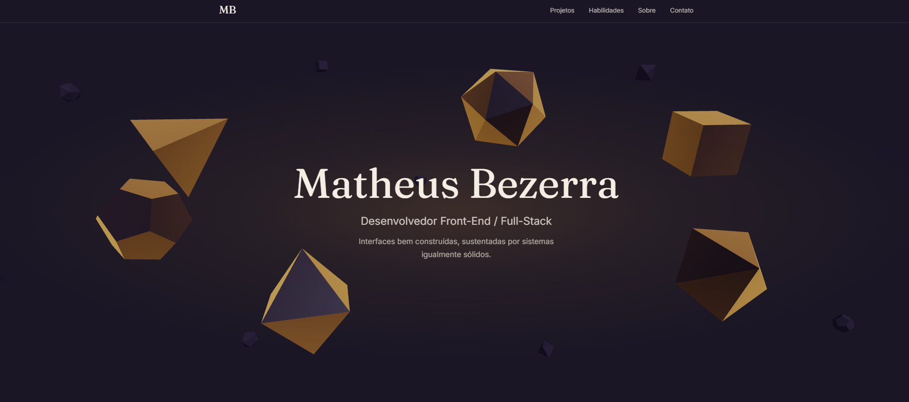

# Matheus Bezerra — Portfolio

Personal portfolio built with Next.js and React Three Fiber, with a 3D hero of six RPG dice and a hidden browser mini-game.

**Live site:** https://matheusbezerra-portfolio.vercel.app

## Resumo em português

Portfólio pessoal de Matheus Bezerra, desenvolvedor front-end / full-stack. Feito em Next.js,
com uma Hero 3D (React Three Fiber) de seis dados de RPG que reagem ao mouse, seções de
Projetos, Habilidades, Sobre e Contato, e um mini-jogo escondido, o "Crítico Natural", na
rota `/critico`. O conteúdo do site é em português.

## Preview



## Highlights

- **Interactive 3D hero** — React Three Fiber scene with the six RPG dice (d4, d6, d8, d10, d12, d20). Each die rotates and bobs on its own; when the mouse gets close, the die is pushed away from the cursor (raycast onto a plane at the die's depth) and eases back afterwards.
- **Sections** — Projects (glass cards with cover images, tech tags and optional "Ver código" / "Ver ao vivo" links), Skills (six flip cards, each illustrated with a 2D die drawn from the same three.js geometry), About (text plus a timeline panel) and Contact (e-mail, GitHub, LinkedIn, a PDF résumé download and a d20 you can drag to spin, with inertia).
- **Hidden mini-game, "Crítico Natural"** at `/critico` — you are a d20: move with WASD/arrow keys, click to fire a shot whose damage (1–20) is pre-rolled and shown above the die, and survive enemy dice (d4 → d20, HP equal to their number of sides) that chase you with increasing frequency. Three lives, a survival timer, game over and restart. Reachable from the ▶ icon next to the "MB" logo and from a link in the Contact section.
- **Reusable section atmosphere** — `SectionAtmosphere` combines an amber radial glow (configurable position, size and strength) with a layer of small background dice; Projects, Skills, About and Contact each use it with their own composition.
- **Navigation extras** — a side navigation (screens ≥ 1280 px) whose die icon lights up for the section in view, and a floating WhatsApp button that appears after the hero.
- **Design tokens as CSS variables** — the palette (`--bg`, `--fg`, `--accent`, `--muted`, `--surface`) and a five-step type scale are defined once in `app/globals.css` and exposed to Tailwind.

## Tech stack

| Area | Used |
| --- | --- |
| Framework | Next.js 16 (App Router), React 19 |
| Language | TypeScript |
| Styling | Tailwind CSS 4 (via `@tailwindcss/postcss`) |
| 3D | three.js + `@react-three/fiber` |
| Animation | Framer Motion (scroll fade-ins and `useReducedMotion`) |
| Fonts | Fraunces and Inter via `next/font/google` |
| Tests | Vitest, Testing Library (`react`, `dom`, `jest-dom`), jsdom |

Exact versions are in `package.json`.

## Project structure

```
app/
  layout.tsx          # root layout: fonts, metadata, <html lang="pt-BR">
  page.tsx            # home: Navbar, SideNav, Hero, Projects, Skills, About, Contact, WhatsApp button
  globals.css         # design tokens (colors, type scale) and global styles
  icon.svg            # favicon (simplified d20)
  critico/page.tsx    # the "Crítico Natural" mini-game page
components/
  Hero3D.tsx          # 3D hero: the six interactive dice
  Projects.tsx        # projects grid (+ ProjectCard.tsx)
  Skills.tsx          # skill flip cards (+ SkillCard.tsx, DieIcon.tsx for the 2D die drawings)
  About.tsx           # bio text and timeline panel
  Contact.tsx         # contact section with the draggable d20
  Navbar.tsx          # top bar with the ▶ shortcut to the game
  SideNav.tsx         # side navigation (+ SideNavList.tsx for the active-section state)
  SectionAtmosphere.tsx # shared glow + background dice layer for sections
  WhatsAppButton.tsx  # floating WhatsApp link
  Section.tsx, FadeIn.tsx, Highlight.tsx # small layout/text helpers
  hero/
    dice.ts           # dice geometries, rest positions and background layouts
    scene.tsx         # shared 3D pieces: materials, lights, background layer, resting d20
    dragSpin.ts       # drag-to-spin physics for the Contact d20
  game/
    engine.ts         # game rules: pure state and functions, no React/three
    Game.tsx          # game rendering, input and HUD
    EnemiesLayer.tsx  # instanced enemy rendering and shatter effect
    format.ts         # timer formatting
data/
  projects.ts         # project cards content
  skills.ts           # skill cards content
public/
  projects/           # project cover images
```

Test files (`*.test.ts` / `*.test.tsx`) live next to the code they test.

## Running locally

```bash
npm install
npm run dev        # development server at http://localhost:3000
npm run build      # production build (also runs the TypeScript check)
npm run start      # serve the production build
npm run test       # run the test suite once
npm run test:watch # run tests in watch mode
```

There is no `lint` script and no ESLint configuration in the project.

Node version: not pinned (no `.nvmrc` and no `engines` field). It was developed with Node 24.19. TODO: verify the minimum supported version.

## Tests

`npm run test` runs 75 tests in 16 files with Vitest in a jsdom environment. WebGL is not available in jsdom, so the 3D canvases are mocked in tests (`vitest.setup.ts` and `app/page.test.tsx`); the 3D scenes themselves are not covered by automated tests.

What the suite covers:

- **Game engine** (`components/game/*.test.ts`): movement and arena limits, the pre-rolled 1–20 damage, shot direction, cooldown, projectile collision (including fast projectiles not tunnelling through enemies), enemy spawning and chasing, player lives, invulnerability, game over and restart, the difficulty ramp (spawn interval, unlock order of enemy types, weighted type selection, enemy cap) and timer formatting.
- **3D helpers** (`components/hero/*.test.ts`): the d10 geometry and dice sizes, and the drag-to-spin physics (direction, velocity cap, inertia decay independent of frame rate).
- **Components**: page section order and the two links to the game; Navbar links and the ▶ shortcut; side navigation and the WhatsApp link; About text, highlights and timeline; Contact links (including the résumé PDF) and the single solid-accent button; skill cards (flip by tap, tap outside and keyboard); project cards (image alt text, pixelated rendering only for the pixel-art cover, repository/live links only when set); `SectionAtmosphere` glow positioning; and the 2D die drawing (only real edges, no triangulation diagonals).

## Design decisions

- **Only the hero runs the full interactive dice scene.** The other sections share `SectionAtmosphere`: a static CSS glow plus a lighter canvas of small background dice with no mouse interaction. The site's canvases (hero, section backgrounds, Contact d20) stop rendering while they are off-screen (IntersectionObserver), and enemies in the game are drawn with one `InstancedMesh` per die type. The Contact d20 is the one other interactive canvas (drag to spin).
- **Game logic is separate from rendering.** `components/game/engine.ts` holds all the rules as plain TypeScript state and functions, with no React or three.js imports, so it is tested directly; `Game.tsx` and `EnemiesLayer.tsx` only read that state and draw it.
- **Reduced motion is handled in code.** Components read `prefers-reduced-motion` (Framer Motion's `useReducedMotion`, Tailwind `motion-reduce:` and a CSS media query): the dice stop rotating and bobbing, fade-ins and card flips run without animation, smooth scrolling is turned off, and the Contact d20 stops its automatic spin while staying draggable. TODO: verify this behavior manually in a browser with reduced motion enabled.
- **Colors are defined in one place.** The palette lives in `app/globals.css`; 3D materials read the same CSS variables at runtime instead of repeating hex values. The one exception is `app/icon.svg`, which has to hard-code the hex values because the browser reads the favicon outside the page.
- **The 2D die illustrations reuse the 3D geometry.** The skill cards and timeline icons are SVGs computed from the same three.js geometries as the hero, rendered on the server, so they ship no WebGL or extra client JavaScript.

## Deployment

Deployed on [Vercel](https://vercel.com) from this GitHub repository. The live site is https://matheusbezerra-portfolio.vercel.app.

TODO: verify that pushes to `main` trigger automatic production deploys (the repository has no Vercel configuration file; the setup lives in the Vercel dashboard).

## Limitations and next steps

- The site is Portuguese only (`lang="pt-BR"`); there is no English version.
- FoundCalc has no repository link yet, and no project has a live-demo link (`liveUrl` in `data/projects.ts`).
- There is no social-media preview image (no Open Graph image or Open Graph metadata).
- The game has no touch controls: on phones you can shoot by tapping, but you cannot move (a virtual joystick is not implemented).
- No linting is set up (no ESLint).
- `@react-three/drei` is still listed in `package.json` but is no longer imported anywhere; it can be removed.
- The FlowForge cover image is not 16:9, so its edges are cropped in the card (its crop is shifted to keep the title visible).
